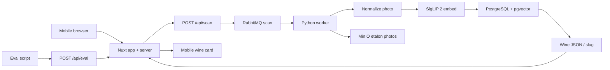

# Architecture

Сканер этикеток «Своё вино»: фото → одна карточка каталога. Слои совпадают с ТЗ.

## Границы слоёв

| Слой | Где | Что делает |
| --- | --- | --- |
| UI | `app/` | Mobile-first: загрузка фото, карточка вина, фича после поиска |
| HTTP | `server/api/` | `scan`, `eval` (`{"slug"}`), карточка, `ready` |
| Каталог | PostgreSQL + pgvector, схема в `server/db/` | Позиции, эмбеддинги, JSON карточки |
| Эталоны | MinIO (`storage`) | Одна эталонная фотография на slug |
| Очередь | RabbitMQ `scan` | Тяжёлый CV вне HTTP, чтобы уложиться в SLA |
| CV | `worker/pipeline/` | Нормализация → признаки (SigLIP 2) → поиск |
| Retention | позже в `app/` + `server/api/` | «Цифровой сомелье» / аналоги, не в критическом пути eval |

Strapi из ТЗ — источник/админка каталога. Runtime поиска идёт в PostgreSQL после импорта дампа JSON/CSV. Отдельный контейнер CMS не входит в скелет.

NuxtHub (`hub:db`, `hub:blob`) — обвязка Nuxt. Поиск по изображению — pgvector + воркер.

## Потоки

1. **Пользователь:** камера/галерея → `POST /api/scan` → очередь `scan` → воркер → карточка + F1 топ-1/топ-5 (в API, не обязательно в UI).
2. **Скрипт оценки:** фото → `POST /api/eval` → плоский `{"slug":"wine-slug"}`. Скрипт меряет время; организатор сверяет slug.
3. **Нет в каталоге:** похожие/аналоги или честный not-found (после появления поиска).

Нормализация поля — отдельный шаг воркера: блики, угол, свет. Это основной рычаг F1 (подсказка ТЗ).

Исходник: [architecture.mmd](architecture.mmd).

## Контракты (скелет)

- `POST /api/eval` → `{"slug":"unknown"}` пока нет модели.
- `POST /api/scan` → `slug` + `confidence.f1_top1` / `f1_top5` + `wine`.
- `GET /api/wines/:slug` → поля карточки.
- `GET /api/ready` → health для воркера.

Целевой SLA ответа — до 3 секунд на оборудовании команды. Деплой во внешний облачный прод не требуется.
