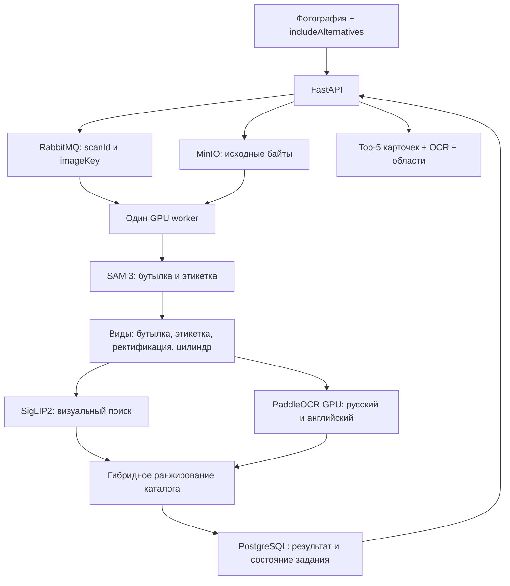

# Распознавание через API

## Архитектура



FastAPI обслуживает HTTP, MinIO сохраняет фотографии, RabbitMQ передаёт задания. Worker заранее загружает модели и обрабатывает по одному изображению. Тяжёлая работа выполняется отдельно от потока RabbitMQ, поэтому соединение продолжает получать heartbeat. API дополняет кандидатов карточками из исправленного каталога.

Численный ML-код сохранён в `worker/pipeline`; адаптер находится в `backend/worker/recognition.py`, очередь — в `backend/worker/main.py`. DINO, LightGlue и LLM в этот runtime не загружаются. Индекс SigLIP2 и текстовый каталог загружаются из bundle; поиск сейчас не использует pgvector, хотя расширение осталось в инфраструктуре коллег.

Геометрия также находится в `worker/pipeline/rectification.py` и
`worker/pipeline/cylinder_geometry.py`. Runtime и Docker-образ не зависят от
`scripts/`: там остаются эксперименты и служебные команды. Текущий bundle
`v5-worker-layout` фиксирует новые пути исходников без изменения алгоритма v5.

### Ранжирование v5

Уверенно прочитанное отличительное название производителя даёт его карточкам
отдельную прибавку к score (+0,25). Она применяется ко всему каталогу до выбора
Top-5. Внутри винодельни порядок уточняют прежние визуальные и текстовые признаки,
включая сорт винограда. При отсутствии уверенного производителя порядок остаётся
прежним. Учитываются варианты фамилий и короткий бренд Inkerman; общие слова вроде
`GRAND RESERVE`, слабый OCR и текст вне выбранной бутылки не задают производителя.
При сопоставимой уверенности в двух производителях приоритет не включается.

В кандидатах доступны `producer_match`, `producer_bonus`, `producer_evidence`
(исходная строка OCR, уверенность и координаты). Это объяснение ранжирования;
совпадение винодельни не подтверждает наличие конкретного вина в каталоге.
`score` может превышать 1 и по-прежнему не является вероятностью.
Контракт Top-5 / `includeAlternatives` не меняется. Версия ответа — `wine-prototype-v5`.
Нужен соответствующий bundle v5; веса, каталог и визуальный индекс остались прежними.

## Вызов из Python

```python
from backend.worker.recognition import initialize, run, shutdown

initialize()  # Один раз при запуске процесса; до приёма запросов.
try:
    result = run(image_bytes, includeAlternatives=True)
finally:
    shutdown()  # Только при завершении сервиса.
```

`image_bytes` — закодированные JPEG/PNG/WebP-байты, не Base64 и не путь. API принимает одно изображение до 30 MiB и 25 мегапикселей. Модель использует одну и ту же внутреннюю десятку кандидатов: `True` возвращает первые пять, `False` — только первого. Флаг не меняет ранжирование.

Полный реальный пример ответа: [examples/scan-response.json](examples/scan-response.json).

В `candidates` включены `slug`, `rank`, `score`, компоненты поиска и свидетельства/противоречия. HTTP-слой добавляет `wine` — карточку. Поле `wine` верхнего уровня повторяет первого кандидата; `alternatives` содержит оставшиеся четыре карточки. Всего пять, а не шесть.

Общие поля фотографии:

- `observations`: OCR-текст, источники и координаты прочитанных надписей;
- `observedFields`: извлечённые сорта, цвет, напечатанные годы и другие поддерживаемые признаки;
- `regions`, `target`, `imageSize`, `coordinateSystem`: области и система координат для наложения на фотографию;
- `cylinder`, `message`, `warnings`: сведения обработки и ограничения;
- `version`, `catalogSha256`, `timingsSeconds`: версия, каталог и время этапов.

Поля внутри OCR и кандидатов сохраняют формат исходного ML-компонента. Их реальные примеры доступны в результатах `scripts/scan_api.py`. Координаты относятся к изображению после применения EXIF orientation; интерфейс должен отображать его в той же ориентации.

`score` не является вероятностью. `confidence=null`, `scoreIsProbability=false`. F1 отсутствует. OCR описывает снимок, а метаданные `wine` описывают каталожную позицию: смешивать эти источники нельзя. Напечатанный год не всегда означает год урожая.

При `no_target` возвращаются `slug="unknown"` и пустые кандидаты. Отказ для отсутствующего в каталоге вина ещё не откалиброван: `candidates_unverified` означает ближайшие варианты, а не подтверждённое совпадение. Ошибки сервиса не маскируются ответом `unknown`.

## Каталог и артефакты

- `backend/catalog/catalog.jsonl`: 2 103 проверенные карточки, точная копия `data/catalog/curated/catalog.jsonl`.
- `backend/catalog/manifest.json`: количество и SHA-256. Каталог API обязан совпадать с каталогом индекса.
- `weights/wine-recognizer-v5-worker-layout-release/`: веса SAM 3, SigLIP2, OCR, индекс и манифест проверенного runtime. Передаётся отдельно от Git.
- `data/deployment/catalog-images-v1.tar`: реальные файлы 2 103 изображений карточек; архив создаётся `python3 scripts/package_catalog_images.py`.

На машине коллег разместить bundle по указанному пути и распаковать изображения:

```bash
mkdir -p data/deployment/catalog-images
tar -xf data/deployment/catalog-images-v1.tar -C data/deployment/catalog-images
```

Исходная папка `data/catalog/curated/images` содержит символические ссылки; переносить только её недостаточно. Архив содержит сами файлы. Изображения карточек нужны UI, для поиска достаточно bundle. Несуществующие цены, рейтинги и годы API возвращает как `null`.

## Запуск

Зависимости фиксируются requirements/lock-файлами, Dockerfile описывает их установку, системные библиотеки и Python. Подробности — [DEPENDENCIES.md](DEPENDENCIES.md).

Для Linux с NVIDIA GPU, совместимым драйвером и NVIDIA Container Toolkit:

```bash
make env
make dev
curl -f http://127.0.0.1:8000/ready
```

Make объединяет базовый Compose, GPU-конфигурацию и DEV mounts. `/health` проверяет только API; `/ready` — свежий heartbeat worker и совпадение каталога. Первая загрузка моделей занимает время. Для production используется `make prod`, порт берётся из `build_env/.env.prod`. После изменения ML-кода перезапустить worker и пересобрать bundle, если изменились файлы, закреплённые в его манифесте.

Для локальной отладки: поднять `db s3 rabbitmq` через Compose, API запустить из `.venv-api` с `PYTHONPATH=backend`, worker — из `.venv` командой `python -m backend.worker.main` в корне проекта. Обоим задать одинаковые `DATABASE_URL`, `S3_ENDPOINT`, `RABBITMQ_HOST/PORT`; worker дополнительно `BACKEND_URL=http://127.0.0.1:8000/health`. Стандартные опубликованные порты: PostgreSQL 5433, MinIO 9006, RabbitMQ 5673. OCR запускается worker автоматически из `.venv-ocr-gpu`.

### Если на Linux не работает Docker bridge

На текущей машине обычная сеть Docker не пропускает обращения к сервисам и DNS сборки. Для неё предусмотрен отдельный профиль с сетью хоста; требуется Compose с поддержкой `!reset`:

```bash
docker compose --env-file build_env/env.prod.example -p wine-integration \
  -f docker-compose.yml -f docker-compose.gpu.yml -f docker-compose.host.yml \
  up -d --build
```

API работает на 8000, PostgreSQL — 5432, MinIO — 9000/9001, RabbitMQ — 5672/15672. Эти порты должны быть свободны. Не запускайте одновременно локальный GPU-worker и контейнерный: каждый загрузит собственные модели. Для обычной установки с работающей сетью Docker этот профиль не требуется.

## Ручки и проверка

| Ручка | Назначение |
| --- | --- |
| `GET /docs` | Интерактивный Swagger |
| `POST /v1/wines/scan` | JSON `imageBase64`, `includeAlternatives`; возвращает `scanId` |
| `GET /v1/wines/scan/{scanId}` | Опрос до `done`/`failed`, полный результат |
| `GET /v1/wines/search?q=...` | Настоящий каталог |
| `GET /v1/wines/{slug}` | Карточка |
| `GET /v1/wines/{slug}/image` | Каталожное изображение |
| `POST /v1/eval/predict` | Multipart `image`; синхронный плоский `{"slug":"..."}` |

Полный Top-5 через API:

```bash
python3 scripts/scan_api.py data/live_shop_photos/abrau-dyurso-risling-beloe-suhoe-12.jpg \
  --base http://127.0.0.1:8000 --output data/audit/my_scan.json
```

Для одного кандидата добавить `--no-alternatives`. Оригинальный скрипт организаторов используется без изменений:

```bash
bash data/eval/participant_test.sh \
  --images-dir data/eval/queries --manifest data/eval/queries.tsv \
  --endpoint http://127.0.0.1:8000/v1/eval/predict \
  --output data/audit/eval_predictions.jsonl
```

Выходной файл не должен существовать. Скрипт ограничивает запрос десятью секундами; запускать последовательно после `/ready` и без конкурирующей GPU-нагрузки. API ждёт до девяти секунд (`EVAL_WAIT_SECONDS`), при превышении возвращает 504. Задание в очереди может завершиться позже. Для пользовательского интерфейса использовать асинхронный путь, не увеличивать таймаут оценщика молча.

## Android

API можно тестировать независимо от приложения. Текущий Android-клиент коллег ожидает немедленный результат сканирования и при исключениях подставляет mock. Для подключения нужны polling по `scanId`, обработка nullable рейтинга/уверенности, отображение Top-5 и OCR-областей, разрешение относительного `imageUrl` через базовый URL. В реальном режиме ошибки нельзя заменять демонстрационными карточками. Эти изменения Android в данную интеграцию не включены.

## Доступ из интернета и локальная конфигурация

API в host-профиле слушает порт 8000. На роутере нужен проброс TCP 8000 на порт 8000 компьютера; его LAN-адрес следует закрепить в DHCP. В UFW разрешается только порт API: `sudo ufw allow 8000/tcp`.

Личные внешние и LAN-адреса не записываются в исходники или шаблоны. Swagger использует относительный адрес `/`, поэтому работает через тот же хост, на котором открыт. Внешний IP не нужен серверу для прослушивания `0.0.0.0:8000`.

При активном VPN исходящие ответы API могут требовать отдельного правила маршрутизации. Для этой машины подготовлена служба `build_env/network/wine-api-routing.service`: она направляет IPv4-ответы с TCP-порта 8000 через основную таблицу маршрутов. Сам адрес берётся из локального `.env.network`, исключённого из Git:

```bash
cp build_env/network.env.example .env.network
# Вписать зарезервированный LAN IPv4 в WINE_API_SOURCE_IP.
bash scripts/install_api_network.sh
```

Установщик требует локальный sudo-пароль, проверяет конфигурацию, сохраняет её в `/etc/wine-api-network.env` с правами 0600 и включает systemd-службу. Он не меняет firewall и не отключает VPN. Уже созданный `.env.network` не перезаписывать командой копирования. Одноразовое правило `ip rule add` без установки службы исчезает при перезагрузке. Установка службы не заменяет закрепление LAN-адреса на роутере.

Исключение для TCP 8000 использует приоритет **9000**, перед текущим общим
правилом VPN **9999** (меньшее число выполняется раньше). Установщик удаляет
прежнее исключение с приоритетом 10000. Если после смены VPN внешний доступ
пропал, сравнить `ip -4 rule show` и маршрут ответа:
`ip -4 route get <CLIENT_IP> from <LAN_IP> ipproto tcp sport 8000`.
Ответ должен идти через LAN-шлюз провайдера; обычный трафик остаётся на VPN.

Внешнюю доступность проверять с телефона без Wi-Fi по `http://<PUBLIC_IP>:8000/ready`. Сейчас API работает по HTTP без авторизации; это временный режим проверки, а не защищённая публикация. Для постоянного доступа нужны HTTPS и контроль доступа. Публичный адрес будет виден клиентам независимо от его отсутствия в Git.
