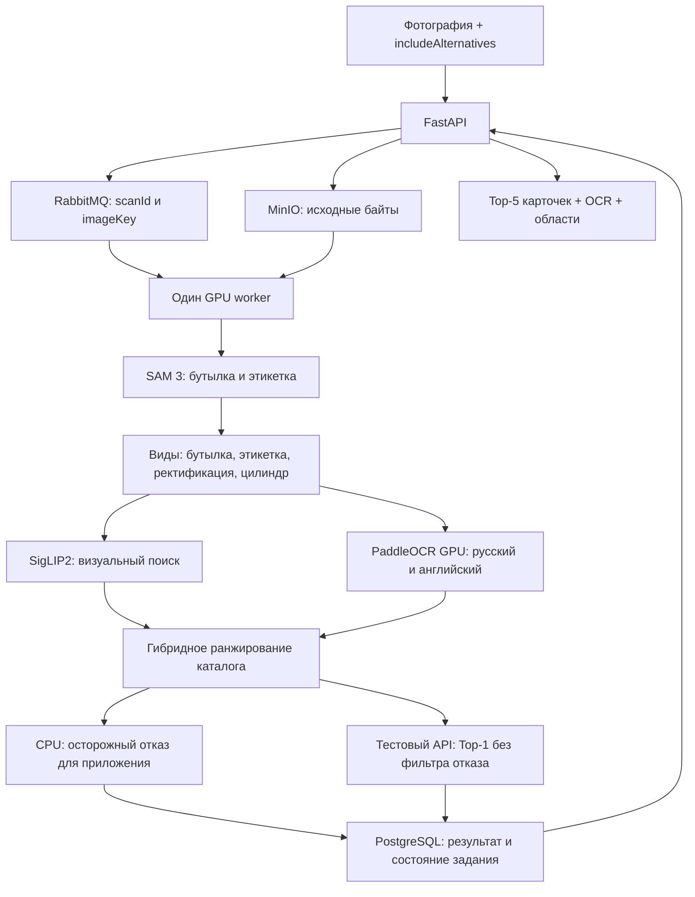

# Распознавание через API

## Архитектура



FastAPI обслуживает HTTP, MinIO сохраняет фотографии, RabbitMQ передаёт задания. Worker заранее загружает модели и обрабатывает по одному изображению. Тяжёлая работа выполняется отдельно от потока RabbitMQ, поэтому соединение продолжает получать heartbeat. API дополняет кандидатов карточками из исправленного каталога.

Численный ML-код сохранён в `worker/pipeline`; адаптер находится в `backend/worker/recognition.py`, очередь — в `backend/worker/main.py`. DINO, LightGlue и LLM в этот runtime не загружаются. Индекс SigLIP2 и текстовый каталог загружаются из bundle; поиск сейчас не использует pgvector, хотя расширение осталось в инфраструктуре коллег.

Геометрия также находится в `worker/pipeline/rectification.py` и
`worker/pipeline/cylinder_geometry.py`. Runtime и Docker-образ не зависят от
`scripts/`: в Git остаются только служебные команды. Текущий bundle
`v5-refusal` добавляет небольшой CPU-фильтр отсутствия; ранжирование v5 сохранено.

### Отказ и режим оценки

`POST /v1/wines/scan` применяет осторожный фильтр к полному Top-5 до ограничения
`includeAlternatives`. При отказе: `recognitionStatus: "not_in_catalog"`,
`slug: "unknown"`, `wine: null`, `candidates: []`, `alternatives: []`, сообщение
«Вино не найдено в каталоге». OCR и координаты сохраняются. При сомнении
возвращаются прежние кандидаты с `candidates_unverified`; это не подтверждение.

**`POST /v1/eval/predict` фильтр не применяет:** возвращает поисковый Top-1 в
плоском `{"slug":"..."}`. Это временная политика до уточнения организаторами
отсутствующих вин в тесте. Если целевой объект не обнаружен, остаётся `unknown`;
ошибки обработки остаются HTTP-ошибками. Внутреннее сообщение очереди содержит
`applyCatalogRefusal: false` для этого маршрута, по умолчанию `true` для сканов.
Флаг не связан с `includeAlternatives` и не добавлен в публичный ScanRequest.

`catalogRefusal` — диагностика: версия, причина, флаг `reject`, служебный score
и порог. Score не является вероятностью и не заполняет `confidence`.
Модель в `catalog_refusal.json` входит в bundle и сверяется с каталогом по SHA.
Новые GPU-модели и Python-зависимости не требуются. Проверка разработки:
0/110 ложных отказов в двух групповых протоколах; это не гарантия для новых фото.

Сохранённые сканы прежней версии каталога допустимы только для явно проверенных
хешей в `backend/catalog/manifest.json`: в этой миграции менялись лишь служебные
заметки трёх карточек. `/ready` продолжает требовать точного текущего SHA worker/API.

### Ранжирование v5

Уверенно прочитанное отличительное название производителя даёт его карточкам
отдельную прибавку к score (+0,25). Она применяется ко всему каталогу до выбора
Top-5. Внутри винодельни порядок уточняют прежние визуальные и текстовые признаки,
включая сорт винограда. При отсутствии уверенного производителя порядок остаётся
прежним. Учитываются варианты фамилий и короткий бренд Inkerman; общие слова вроде
`GRAND RESERVE`, слабый OCR и текст вне выбранной бутылки не задают производителя.
При сопоставимой уверенности в двух производителях приоритет не включается.

В кандидатах доступны `producer_match`, `producer_bonus`, `producer_evidence`
(исходная строка OCR, уверенность и координаты). Это объяснение ранжирования;
совпадение винодельни не подтверждает наличие конкретного вина в каталоге.
`score` может превышать 1 и по-прежнему не является вероятностью.
Контракт Top-5 / `includeAlternatives` не меняется. Версия ответа — `wine-prototype-v5`.
Нужен соответствующий bundle v5; веса, каталог и визуальный индекс остались прежними.

## Вызов из Python

```python
from backend.worker.recognition import initialize, run, shutdown

initialize()  # Один раз при запуске процесса; до приёма запросов.
try:
    result = run(image_bytes, includeAlternatives=True)
finally:
    shutdown()  # Только при завершении сервиса.
```

`image_bytes` — закодированные JPEG/PNG/WebP-байты, не Base64 и не путь. API принимает одно изображение до 30 MiB и 25 мегапикселей. Модель использует одну и ту же внутреннюю десятку кандидатов: `True` возвращает первые пять, `False` — только первого. Флаг не меняет ранжирование.

Полный реальный пример ответа: [examples/scan-response.json](examples/scan-response.json).

В `candidates` включены `slug`, `rank`, `score`, компоненты поиска и свидетельства/противоречия. HTTP-слой добавляет `wine` — карточку. Поле `wine` верхнего уровня повторяет первого кандидата; `alternatives` содержит оставшиеся четыре карточки. Всего пять, а не шесть.

Общие поля фотографии:

- `observations`: OCR-текст, источники и координаты прочитанных надписей;
- `observedFields`: извлечённые сорта, цвет, напечатанные годы и другие поддерживаемые признаки;
- `regions`, `target`, `imageSize`, `coordinateSystem`: области и система координат для наложения на фотографию;
- `cylinder`, `message`, `warnings`: сведения обработки и ограничения;
- `version`, `catalogSha256`, `timingsSeconds`: версия, каталог и время этапов.

Поля внутри OCR и кандидатов сохраняют формат исходного ML-компонента. Их реальные примеры доступны в результатах `scripts/scan_api.py`. Координаты относятся к изображению после применения EXIF orientation; интерфейс должен отображать его в той же ориентации.

`score` не является вероятностью. `confidence=null`, `scoreIsProbability=false`. F1 отсутствует. OCR описывает снимок, а метаданные `wine` описывают каталожную позицию: смешивать эти источники нельзя. Напечатанный год не всегда означает год урожая.

### Оценка каждого кандидата: `matchScore`

Bundle `v5-score` добавляет `candidates[].matchScore` в диапазоне 0–1 и
`matchScoreIsProbability=false`. Прежний `score`, порядок и решение об отказе
сохранены. В API проверки организаторов ответ по-прежнему только `{"slug":"…"}`.

CPU-модель учитывает визуальные/OCR-признаки всей пятёрки и отставание каждого
кандидата от лучшего поискового score. Коэффициент отставания ограничен так,
чтобы не менять порядок. Это абсолютные оценки: сумма не обязана равняться 1,
все пять могут быть низкими. Разные годы одного вина допускаются как совпадения;
score не подтверждает точный год. При одинаковых исходных score оценки равны.

`candidateScoring` содержит `version`, `status`, `top1Gap`, `refusalCapApplied`
и исходные пять `candidates` с `slug`, `rank`, `matchScore`, `retrievalScore`.
Диагностика остаётся при `includeAlternatives=false` и при `not_in_catalog`;
это не карточки рекомендаций. При отказе оценки ограничены сверху 0,1.
Если модель отсутствует в старом bundle, поле диагностики пустое; при неполных
данных `status=unavailable`, а `matchScore` отсутствует: не подменять его нулём.

**Ограничения:** score не является калиброванной вероятностью и не заменяет
`confidence=null`. Не вводить дополнительный порог скрытия карточек в клиенте.
На 161 development-фото проверка с исключением групп вин/виноделен дала
медианный отрыв правильного кандидата 0,53/0,68. Все пять оценок ниже 0,2 у
37/51 и 35/51 отсутствующих вин; 1/51 и 3/51 получили ошибочный score ≥0,8.
Denisov Riesling всё ещё получает заниженную оценку. Это не независимый финальный
тест. Критерий «у любого отсутствующего вина все оценки низкие» пока не достигнут.

### Аналоги при отсутствии вина

При `not_in_catalog` ответ сохраняет `slug=unknown`, `wine=null`, пустые
`candidates` и `alternatives`, но добавляет отдельный список `recommendations`.
Каждый элемент содержит `slug`, `rank`, `wine`, `tier`, `reasons`, `attributes`,
`textSimilarity`, `criteriaSources`, `commonGrapes`, `unmatchedGrapes`,
`unknownQueryFields` и доступные `servingAdvice` (блюда, температура, источник).
`includeAlternatives` ограничивает список пятью или одной карточкой.

Исходный поисковый Top-1 — **карточка-ориентир**, исключаемая из аналогов.
Цвет и сладость из OCR целевой бутылки с уверенностью ≥0,8 задают строгие
ограничения. Пропуски заполняются свойствами Top-1 как предположением, с источником
`retrieval_top1_reference`; прочитанные имеют источник `photo_ocr`. При конфликте
цвета/сахара между OCR-чтениями аналоги не выдаются. Неизвестный сахар кандидата
не считается совпадением. Ручные исправления каталога важнее названия и явных
слов в slug; числовые суффиксы не интерпретируются.

Приоритет: цвет + сахар + общие сорта; цвет + сахар; общие сорта; производитель.
Внутри группы учитываются покрытие сортов и косинусное сходство текстовых
эмбеддингов с Top-1, затем производитель. Ограничения цвета и сахара не ослабляются
ради производителя. Общие сорта не означают идентичность купажа.

`recommendationContext` содержит `anchor`, `profile` (только OCR со свидетельствами),
`criteria`, `criteriaSources`, `semanticStatus`, `semanticModel` и `status`:
`available`, `insufficient_evidence`, `ambiguous_evidence`, `no_suitable_analogs`.
Top-1 не признаётся сфотографированным вином (`isRecognizedWine=false`). Свойства
ориентира не копируются в `observedFields`. При `no_target` и обычном распознавании
аналогов нет. `/v1/eval/predict` не изменён.

**Для мобилки:** показать «Вино не найдено в каталоге» и отдельный блок «Возможные
аналоги». Если использованы свойства Top-1, указать «Подобрано по ближайшей
карточке; свойства сфотографированного вина подтверждены не полностью».
`textSimilarity` (−1…1) — сходство описаний, не вероятность и не `matchScore`;
не отображать как уверенность распознавания. Оно не гарантирует одинаковый вкус,
особенно если ориентир выбран неудачно.

Модель `intfloat/multilingual-e5-small` используется офлайн. В текст входят
описание, цвет/сахар/сорта, доступные блюда и температура. Названия и производители
исключены, чтобы бренд не подменял сходство свойств. API использует только готовые
векторы на CPU. Описания есть у всех 2103 карточек, блюда и температура пока
отдельно сохранены у четырёх: `backend/catalog/recommendation_metadata.json`
содержит значения и источники. Пропуски не генерируются. При недоступном или
несовместимом индексе работает подбор по атрибутам: `semanticStatus=unavailable`,
`textSimilarity=null`.

При `no_target` возвращаются `slug="unknown"` и пустые кандидаты. В обычном скане такой же пустой результат может дать осторожный фильтр со статусом `not_in_catalog`; тестовый маршрут этот фильтр обходит. `candidates_unverified` означает ближайшие варианты, а не подтверждённое совпадение. Ошибки сервиса не маскируются ответом `unknown`.

## Предобработка фотографии перед отправкой

Проверка 2026-09-21: 76 изображений `data/live_shop_photos`, из них 36 с заранее
проверенным slug. Сравнены оригинал и восемь вариантов через работающий v5 API
(684 запроса), дополнительно 3200 px на шести сложных снимках (18 запросов).
На всех вариантах строгий Top-1 = 35/36, Top-5 = 36/36; единственный Top-2
Абрау-Дюрсо был и у оригинала. Это выборка разработки, не независимый тест.

| Вход | Worker median / p95, с | Медианный файл, МБ |
|---|---:|---:|
| Оригинал, длинная сторона 4000 | 3,44 / 4,24 | 7,60 |
| JPEG 90, исходный размер | 3,41 / 4,12 | 2,08 |
| Lanczos 2560, JPEG 90 | 2,37 / 2,81 | 0,94 |
| Lanczos 2048, JPEG 90 | 1,98 / 2,44 | 0,63 |
| Lanczos 1600, JPEG 90 | 1,67 / 1,96 | 0,41 |
| Lanczos 1280, JPEG 90 | 1,43 / 1,66 | 0,27 |

Время worker исключает подготовку на телефоне, передачу и очередь. Подготовка
2560 на серверном CPU заняла медианно 0,32 с; суммарно подготовка + worker —
2,69 с против 3,44 с у оригинала. Это не замер Android или мобильной сети.

### Принятое поведение: телефон и оценка метрик

| Сценарий | Что отправляется | Где применяется подготовка |
|---|---|---|
| Телефон: камера или галерея | EXIF → RGB → Lanczos, длинная сторона не более 2560 px → JPEG 90, 4:2:0 | В мобильном клиенте, до Base64 |
| Скрипт оценки метрик | Исходный файл, без resize и повторного JPEG-сжатия, с сохранённым EXIF | Дополнительная клиентская подготовка отсутствует |

Для телефона выбран компромисс `lanczos2560_q90`; это профиль по умолчанию
`scripts/prepare_scan_image.py`. Интеграция Android получена в коммите `ba18184`.
В `ImageOrientationHelper` пока заданы другие значения по умолчанию: 2048 px
и JPEG quality 85. Согласование мобильной реализации с профилем 2560/90 остаётся
отдельной задачей; Python-утилита не меняет установленное приложение.

Для метрик использовать оригиналы, **не `jpeg90_full`**: даже полноразмерное
пересжатие может изменить OCR и порядок кандидатов. `participant_test.sh`
передаёт файл multipart в `/v1/eval/predict`, а `scripts/scan_api.py` кодирует
исходные байты в Base64; обе команды работают без дополнительного resize.
Не передавать им каталог подготовленных телефонных JPEG вместо исходных фото.

API сохраняет полученные байты. Обе ручки используют один worker v5; общий лимит
2560 перед распознаванием не вводится. Worker применяет имеющийся EXIF и затем
свои прежние масштабы для моделей и OCR-фрагментов. Это сохраняет детали исходного
фото до выбора областей и не требует отдельной версии модели для метрик.

Ограничения выбранного телефонного компромисса: на снимке №42 («Перовских») confidence названия
упал ниже 0,85 и отключился producer bonus; на №73 перестало извлекаться «Белое»,
на №46 — год. У 2048 и меньших размеров дополнительно терялись сорта винограда.
Даже 3200 не восстановил producer bonus на №42. Автоматический resize в API/worker
не включён. Результаты и эталонные байты: `data/audit/input_resize/v1/`, включая
`review.html`, `summary.json`, `evidence_changes.json`, `manifest.json` и `inputs/`.
Артефакты локальные, в Git не входят.

Общий порядок для камеры и галереи:

1. Прочитать исходный файл вместе с EXIF; применить поворот и отражение к пикселям.
2. Привести к RGB; прозрачность, если есть, наложить на белый фон.
3. Уменьшить длинную сторону до 2560, сохранить пропорции;
   `scale=min(1, 2560/max(width,height))`. Не обрезать и не увеличивать маленькие фото.
4. Один раз сохранить JPEG quality=90, chroma subsampling=4:2:0. EXIF больше не
   копировать: пиксели уже ориентированы. Не применять дополнительную резкость.
5. Передать полученные байты как Base64 в существующий POST `/v1/wines/scan`.

Эталонная реализация — `scripts/image_preprocessing.py` (Pillow Lanczos). Android
с другим декодером/фильтром/JPEG-кодировщиком не гарантирует те же байты даже при
quality=90; порт нужно сравнить с сохранёнными примерами перед сменой настроек.
Потерянный до этого шага EXIF восстановить из метаданных уже нельзя.

```bash
# Воспроизвести телефонную подготовку: профиль 2560/JPEG 90 по умолчанию.
.venv/bin/python scripts/prepare_scan_image.py photo.jpg \
  --output data/prepared/photo-2560.jpg

python3 scripts/scan_api.py data/prepared/photo-2560.jpg --output data/prepared/result.json

# Проверка на оригинале: обойти prepare_scan_image.py.
python3 scripts/scan_api.py photo.jpg --output data/original-result.json
```

Команда сохраняет рядом JSON с размерами и `scale_xy`, не перезаписывает файлы.
Области ответа относятся к **отправленному** фото (`imageSize`). Для наложения
на ориентированный исходник делить x/y на соответствующий `scale_xy`; затем
применять масштаб и смещение отображения на экране. Проще отображать тот же
подготовленный JPEG. API-контракт и bundle v5 для этой клиентской подготовки
не меняются.

## Каталог и артефакты

- `backend/catalog/catalog.jsonl`: 2 103 проверенные карточки, точная копия `data/catalog/curated/catalog.jsonl`.
- `backend/catalog/manifest.json`: количество и SHA-256. Каталог API обязан совпадать с каталогом индекса.
- `weights/wine-recognizer-v5-score-release/`: веса SAM 3, SigLIP2, OCR, индекс и манифест проверенного runtime. Передаётся отдельно от Git.
- `data/deployment/catalog-images-v1.tar`: реальные файлы 2 103 изображений карточек; архив создаётся `python3 scripts/package_catalog_images.py`.

На машине коллег разместить bundle по указанному пути и распаковать изображения:

```bash
mkdir -p data/deployment/catalog-images
tar -xf data/deployment/catalog-images-v1.tar -C data/deployment/catalog-images
```

Исходная папка `data/catalog/curated/images` содержит символические ссылки; переносить только её недостаточно. Архив содержит сами файлы. Изображения карточек нужны UI, для поиска достаточно bundle. Несуществующие цены, рейтинги и годы API возвращает как `null`.

## Запуск

Зависимости фиксируются requirements/lock-файлами, Dockerfile описывает их установку, системные библиотеки и Python. Подробности — [DEPENDENCIES.md](DEPENDENCIES.md).

Для Linux с NVIDIA GPU, совместимым драйвером и NVIDIA Container Toolkit:

```bash
make env
make dev
curl -f http://127.0.0.1:8000/ready
```

Make объединяет базовый Compose, GPU-конфигурацию и DEV mounts. `/health` проверяет только API; `/ready` — свежий heartbeat worker и совпадение каталога. Первая загрузка моделей занимает время. Для production используется `make prod`, порт берётся из `build_env/.env.prod`. После изменения ML-кода перезапустить worker и пересобрать bundle, если изменились файлы, закреплённые в его манифесте.

Для локальной отладки: поднять `db s3 rabbitmq` через Compose, API запустить из `.venv-api` с `PYTHONPATH=backend`, worker — из `.venv` командой `python -m backend.worker.main` в корне проекта. Обоим задать одинаковые `DATABASE_URL`, `S3_ENDPOINT`, `RABBITMQ_HOST/PORT`; worker дополнительно `BACKEND_URL=http://127.0.0.1:8000/health`. Стандартные опубликованные порты: PostgreSQL 5433, MinIO 9006, RabbitMQ 5673. OCR запускается worker автоматически из `.venv-ocr-gpu`.

### Если на Linux не работает Docker bridge

На текущей машине обычная сеть Docker не пропускает обращения к сервисам и DNS сборки. Для неё предусмотрен отдельный профиль с сетью хоста; требуется Compose с поддержкой `!reset`:

```bash
docker compose --env-file build_env/env.prod.example -p wine-integration \
  -f docker-compose.yml -f docker-compose.gpu.yml -f docker-compose.host.yml \
  up -d --build
```

API работает на 8000, PostgreSQL — 5432, MinIO — 9000/9001, RabbitMQ — 5672/15672. Эти порты должны быть свободны. Не запускайте одновременно локальный GPU-worker и контейнерный: каждый загрузит собственные модели. Для обычной установки с работающей сетью Docker этот профиль не требуется.

## Ручки и проверка

| Ручка | Назначение |
| --- | --- |
| `GET /docs` | Интерактивный Swagger |
| `POST /v1/wines/scan` | JSON `imageBase64`, `includeAlternatives`; возвращает `scanId` |
| `GET /v1/wines/scan/{scanId}` | Опрос до `done`/`failed`, полный результат |
| `GET /v1/wines/search?q=...` | Настоящий каталог |
| `GET /v1/wines/{slug}` | Карточка |
| `GET /v1/wines/{slug}/image` | Каталожное изображение |
| `POST /v1/eval/predict` | Multipart `image`; синхронный плоский `{"slug":"..."}` |

Полный Top-5 через API:

```bash
python3 scripts/scan_api.py data/live_shop_photos/abrau-dyurso-risling-beloe-suhoe-12.jpg \
  --base http://127.0.0.1:8000 --output data/audit/my_scan.json
```

Для одного кандидата добавить `--no-alternatives`. Оригинальный скрипт организаторов используется без изменений:

```bash
bash data/eval/participant_test.sh \
  --images-dir data/eval/queries --manifest data/eval/queries.tsv \
  --endpoint http://127.0.0.1:8000/v1/eval/predict \
  --output data/audit/eval_predictions.jsonl
```

Выходной файл не должен существовать. Скрипт ограничивает запрос десятью секундами; запускать последовательно после `/ready` и без конкурирующей GPU-нагрузки. API ждёт до девяти секунд (`EVAL_WAIT_SECONDS`), при превышении возвращает 504. Задание в очереди может завершиться позже. Для пользовательского интерфейса использовать асинхронный путь, не увеличивать таймаут оценщика молча.

## Android

API можно тестировать независимо от приложения. Текущий Android-клиент коллег ожидает немедленный результат сканирования и при исключениях подставляет mock. Для подключения нужны polling по `scanId`, обработка nullable рейтинга/уверенности, отображение Top-5 и OCR-областей, разрешение относительного `imageUrl` через базовый URL. В реальном режиме ошибки нельзя заменять демонстрационными карточками. Эти изменения Android в данную интеграцию не включены.

## Доступ из интернета и локальная конфигурация

API в host-профиле слушает порт 8000. На роутере нужен проброс TCP 8000 на порт 8000 компьютера; его LAN-адрес следует закрепить в DHCP. В UFW разрешается только порт API: `sudo ufw allow 8000/tcp`.

Личные внешние и LAN-адреса не записываются в исходники или шаблоны. Swagger использует относительный адрес `/`, поэтому работает через тот же хост, на котором открыт. Внешний IP не нужен серверу для прослушивания `0.0.0.0:8000`.

При активном VPN исходящие ответы API могут требовать отдельного правила маршрутизации. Для этой машины подготовлена служба `build_env/network/wine-api-routing.service`: она направляет IPv4-ответы с TCP-порта 8000 через основную таблицу маршрутов. Сам адрес берётся из локального `.env.network`, исключённого из Git:

```bash
cp build_env/network.env.example .env.network
# Вписать зарезервированный LAN IPv4 в WINE_API_SOURCE_IP.
bash scripts/install_api_network.sh
```

Установщик требует локальный sudo-пароль, проверяет конфигурацию, сохраняет её в `/etc/wine-api-network.env` с правами 0600 и включает systemd-службу. Он не меняет firewall и не отключает VPN. Уже созданный `.env.network` не перезаписывать командой копирования. Одноразовое правило `ip rule add` без установки службы исчезает при перезагрузке. Установка службы не заменяет закрепление LAN-адреса на роутере.

Исключение для TCP 8000 использует приоритет **1**, перед наблюдавшимися общими
правилами VPN **99/8999/9999** (меньшее число выполняется раньше). Установщик удаляет
прежние исключения с приоритетами 100, 9000 и 10000. Статус службы `active` сам по себе
не гарантирует правильный маршрут. Если после смены VPN внешний доступ
пропал, сравнить `ip -4 rule show` и маршрут ответа:
`ip -4 route get <CLIENT_IP> from <LAN_IP> ipproto tcp sport 8000`.
Ответ должен идти через LAN-шлюз провайдера; обычный трафик остаётся на VPN.

Внешнюю доступность проверять с телефона без Wi-Fi по `http://<PUBLIC_IP>:8000/ready`. Сейчас API работает по HTTP без авторизации; это временный режим проверки, а не защищённая публикация. Для постоянного доступа нужны HTTPS и контроль доступа. Публичный адрес будет виден клиентам независимо от его отсутствия в Git.
