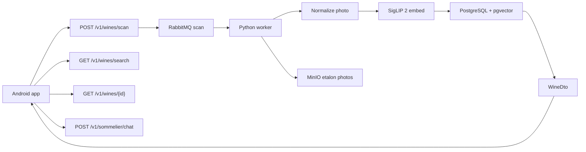

# Architecture

Сканер этикеток «Своё вино»: фото с Android → карточка каталога. HTTP совпадает с `mobile_app` `ApiService`.

## Границы слоёв

| Слой | Где | Что делает |
| --- | --- | --- |
| UI | `mobile_app/` | Камера, поиск, карточка, сомелье, история (Room) |
| HTTP | `backend/api/` FastAPI | `v1/wines/scan`, `search`, `{id}`, `v1/sommelier/chat` |
| Каталог | PostgreSQL + pgvector | Позиции и эмбеддинги |
| Эталоны | MinIO (`storage`) | Эталонные фото |
| Очередь | RabbitMQ `scan` | CV вне HTTP |
| CV | `backend/worker/pipeline/` | Нормализация → SigLIP 2 → поиск |

OpenAPI: интерактивно http://localhost:3000/docs, файл [openapi.yaml](openapi.yaml).

## Потоки

1. **Скан:** `POST /v1/wines/scan` пишет задачу `pending` в БД и кладёт `{scanId, imageKey}` в очередь `scan`. Приложение опрашивает `GET /v1/wines/scan/{scanId}` до `done` / `failed`. Пока модель не готова, воркер пишет stub-результат.
2. **Поиск / карточка:** `GET /v1/wines/search`, `GET /v1/wines/{id}`.
3. **Сомелье:** `POST /v1/sommelier/chat`.
4. **История** только в приложении.

Исходник: [architecture.mmd](architecture.mmd).
