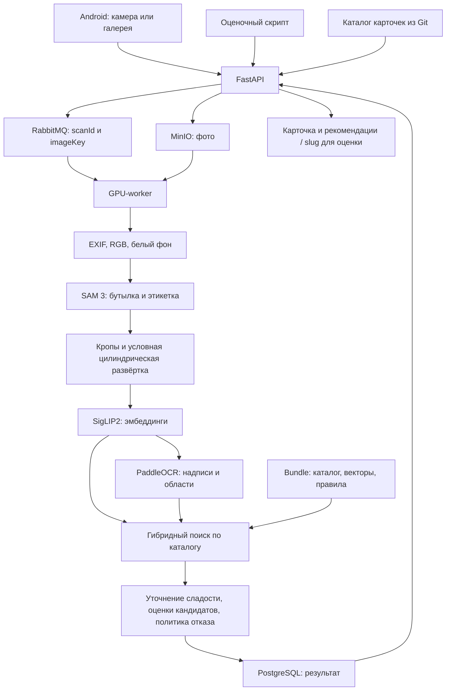

# Архитектура

Сервис распознаёт этикетку, выбирает карточку из согласованного каталога и возвращает результат в Android или оценочный скрипт. Установка, конфигурация, HTTP-пример оценки и ограничения — в [README.md](../README.md). Контракт — [openapi.yaml](openapi.yaml) и `/openapi.json` запущенного API; исходник схемы — [architecture.mmd](architecture.mmd).

## Компоненты и границы слоёв

| Слой | Код | Ответственность |
|---|---|---|
| Android | `mobile_app/WineApp` | Камера, подготовка фото, отправка и polling, отображение карточек, локальная история |
| HTTP API | `backend/api` | Проверка входа, каталог карточек, создание заданий, результаты, подтверждение и рекомендации |
| Очередь и хранилища | Docker-сервисы | RabbitMQ — задания; MinIO — фотографии; PostgreSQL — карточки, состояния, результаты и heartbeat worker |
| GPU-worker | `backend/worker` | Получение задания, загрузка фото, вызов ML, правила выдачи и сохранение результата |
| ML-ядро | `worker/pipeline` | Нормализация, сегментация, геометрия, признаки, OCR и ранжирование |
| Ресурсы | `weights/`, `data/deployment/` | Веса, индекс, правила и изображения; доставляются отдельно от Git |

API не загружает нейросети. Worker загружает модели один раз и обрабатывает задания последовательно. PyTorch и Paddle работают в разных процессах с отдельными Python-окружениями; инференс SigLIP2 и OCR выполняется последовательно, что ограничивает одновременное потребление GPU-памяти.



## 1. Нормализация фотографии

Телефон применяет EXIF-ориентацию, уменьшает длинную сторону до 2560 пикселей и кодирует JPEG с качеством 90. Для оценки принимаются оригинальные файлы: уменьшение и JPEG-перекодирование в этот маршрут специально не добавляются.

API проверяет, что загружено одно корректное изображение до 30 МиБ и 25 мегапикселей, сохраняет байты в MinIO и создаёт задание. Worker повторно учитывает EXIF, преобразует изображение в RGB и заменяет прозрачность белым фоном. Координаты результата относятся к изображению после исправления ориентации.

## 2. Выделение цели и подготовка видов

SAM 3 предлагает области бутылки/упаковки и этикетки. Из нескольких гипотез выбирается одна цель с учётом положения, площади и уверенности; при выборе целого объекта подавляются вложенные фрагменты. Получаются маски, ограничивающие прямоугольники и кропы.

Для поиска используются семейства видов `body` (бутылка/упаковка), `label` (этикетка) и, когда геометрическая модель успешно построена, `flat` (цилиндрическая развёртка). Развёртка условная: не каждый снимок допускает устойчивую аппроксимацию. Если цель не найдена, возвращается `no_target` без выдуманных кандидатов.

## 3. Извлечение визуальных и текстовых признаков

Каждый доступный вид приводится к 384×384 с сохранением пропорций и белыми полями. SigLIP2 извлекает эмбеддинг. Каталожные векторы рассчитаны заранее и поставляются в bundle: 6 011 представлений для 2 103 карточек. На запросе индекс не пересчитывается; дополнительные синтетические позы в финальном поиске отключены (`augment=False`).

PaddleOCR использует `PP-OCRv5_server_det` для областей текста и две модели чтения — кириллицы и латиницы. OCR обрабатывает кропы и доступную развёртку, сохраняет текст, уверенность и полигоны, затем переводит координаты обратно на фото. Принадлежность надписи целевой бутылке проверяется по маске. CRAFT проверялся в экспериментах; финальный worker использует детектор PaddleOCR.

Слова сопоставляются с полями каталога и словарями производителей, сортов, цвета и сладости. Неоднозначные наблюдения сохраняются отдельно от подтверждённых свойств карточки.

## 4. Поиск и ранжирование

Поиск выполняется по NumPy-индексу bundle, а не через pgvector. Для каждого вина объединяются визуальные сходства доступных видов. Веса `body / label / flat` равны `0,5 / 0,3 / 0,2` и нормируются по реально доступным ветвям.

Текстовый поиск учитывает редкость слов, поле каталога, качество OCR, приблизительное совпадение и конфликты. Отдельно определяется уверенно прочитанный производитель. Итоговый базовый балл:

```text
S = V + 0.15 × r × T + 0.25 × P
```

- `V` — объединённое визуальное сходство.
- `T` — неотрицательный текстовый балл, делённый на максимум из 1 и лучшего текстового балла среди карточек.
- `r` — сила различающих слов названия/сорта; без достаточного текстового свидетельства производителя она ослабляется.
- `P` — 1 при совпадении уверенно определённого производителя с карточкой, иначе 0.

Это заданная в коде эвристика, а не вероятность. Ранжируются все карточки, затем ML-ядро возвращает Top-10. Адаптер worker может уточнить порядок близких вариантов по надёжно прочитанной сладости и проверенным данным каталога; вычисляет `matchScore` и применяет отдельную политику отказа для пользовательского сценария. На выходе остаётся пять или один кандидат согласно `includeAlternatives`. Сам этот флаг не меняет поиск.

Год сам по себе не служит признаком отсутствия продукта. Изменения численного кода или каталога требуют согласованного bundle и повторной проверки качества: манифест фиксирует SHA-256 runtime-файлов, весов и индекса.

## 5. Выдача карточки и оценка

Worker записывает статус и результат в PostgreSQL. API сопоставляет `slug` с карточкой, добавляет доступные изображения и пользовательские рекомендации. Android опрашивает состояние скана до `done` или `failed`; пользовательский выбор хранится отдельно от исходного ML-ранжирования.

| Интерфейс | Поведение |
|---|---|
| `/v1/wines/scan` и polling | Кандидаты, OCR, `matchScore`, статус наличия, рекомендации и времена стадий |
| `/v1/wines/scan/{scanId}/confirmation` | Сохранение выбранного кандидата и пересчёт рекомендаций |
| `/v1/eval/predict` | Тот же реальный worker; синхронный `{"slug":"..."}`, без рекомендаций и применения отказа по отсутствию |

Оценочный скрипт измеряет время всего HTTP-запроса. Поле `timingsSeconds` пользовательского ответа содержит измерения worker и не заменяет сквозную задержку. `/ready` проверяет свежий heartbeat и совпадение версии каталога, `/health` — доступность API.

## Дополнительные функции

**Рекомендации.** API применяет правила совместимости цвета, сладости, сортов и производителя; для подходящего ориентира использует готовые текстовые векторы `multilingual-e5-small`. Подтверждённая карточка или достаточно сильный Top-1 задаёт ориентир. Для слабого совпадения используются OCR и осторожный подбор по производителю/линейке. При `not_in_catalog` свойства берутся только из наблюдений на фото; при недостаточных или противоречивых данных список может быть пустым. Рекомендации не меняют поисковый Top-1.

**Цифровой сомелье.** Текущий Android-клиент обращается к GigaChat, передавая историю диалога и контекст карточки. Это отдельная интеграция вне ML-распознавания. HTTP-маршрут сомелье в FastAPI содержит простой ответ по правилам и не является этим LLM-клиентом.

**История, рулетка и винный путь.** Android сохраняет сканы и пользовательские состояния локально в Room, показывает карточки, предлагает выбор вина через рулетку и отображает прогресс винного пути. Эти функции используют клиентские репозитории и данные карточек, не участвуя в извлечении признаков и оценочном маршруте.

## Детектор камеры

В Android встроен YOLO26n для нахождения этикетки в preview и автосъёмки одной устойчивой центральной цели. Обучение: GRAIN, 15 эпох при размере 416; экспорт для телефона — float32, вход 320×320. LiteRT использует GPU с CPU fallback. JSON-контракт рядом с моделью задаёт нормализацию, выход и NMS; файл модели 9,3 МиБ включён в Git.

На внутренней проверке GRAIN при пороге 0,7 хотя бы одна этикетка найдена на 359 из 369 положительных фото; ложные обнаружения были на 15 из 64 фото других товаров. На S25+ отдельный model-only замер дал 5,68 мс на GPU и 8,10 мс на CPU/4 потока: это не полный цикл CameraX и не время серверного распознавания.

Автосъёмка требует три стабильных кадра. Рамки и переключатель детектора в интерфейсе скрыты, ручная съёмка сохранена. Детектор может реагировать на масло/уксус, не определяет `slug` и не заменяет SAM 3 и поиск на сервере. Исследовательские отчёты и подробная история интеграции сохранены локально.

## Каталог и состояние

Канонические метаданные находятся в `backend/catalog`; bundle содержит согласованную копию для ML. API при старте заполняет PostgreSQL из файла, а включённый фоновый импорт может дополнить БД карточками с сайта. Эти добавления не расширяют ML-индекс автоматически.

MinIO хранит поступившие фото, RabbitMQ передаёт ссылки на задания, PostgreSQL хранит результаты и heartbeat. Изображения каталога и индексы рекомендаций подключаются отдельными каталогами. Компоненты сохраняют свои границы: API не обучает модели, worker не формирует экран приложения, оценочный маршрут не зависит от LLM или рекомендаций.
