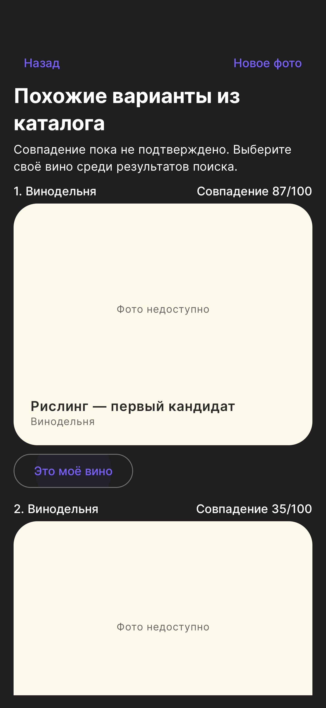
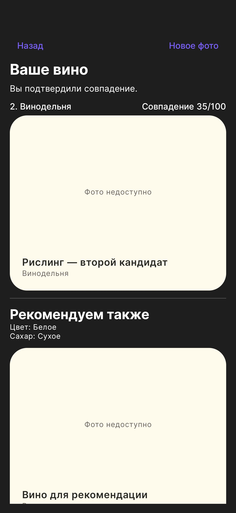
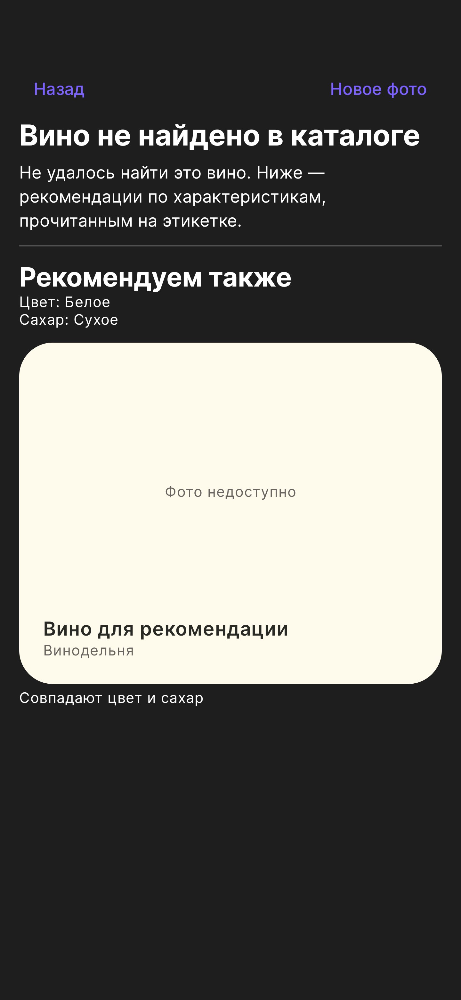

# Передача мобильному разработчику

## Кратко для разработчика

Интеграция уже реализована в ветке `feature/mobile-scan-confirmation-detector`. Нужно перенести ветку целиком после публикации, указать локальный `WINE_API_BASE_URL`, собрать Debug и проверить на телефоне:

- камера, галерея, повторное «Новое фото», возврат из фона;
- Top-1 > 50/100, ручное исправление, отказ сервера и рекомендации;
- автосохранение фото/статуса, обновление старой установки без удаления истории;
- одинаковую нарастающую вибрацию для камеры и галереи, отмену при ошибке/уходе с экрана.

Сохранить Hilt singleton модели и общий поток инференса, миграцию Room 6 → 7, API-маппинг и локальную конфигурацию адреса. Новые веса сервера или ML-данные клиенту не нужны. `scripts/install_api_network.sh` нужен только машине, на которой работает общий API; мобильному разработчику запускать его не требуется.

В `scripts/` остаются только самостоятельные CLI; приложение эту папку не импортирует. Эталонная Python-подготовка фото находится в `worker/image_preprocessing.py`, команда для её отдельного запуска — `scripts/prepare_scan_image.py`. Android использует собственную реализацию подготовки фото.

## Что получить

Достаточно кода репозитория и адреса общего API, переданного отдельно. Серверные `weights/`, `data/`, каталог и фотографии скачивать на телефон не нужно. В Git добавлен один мобильный детектор: `mobile_app/WineApp/app/src/main/assets/models/wine_label_yolo26n_320.tflite` (9 757 969 байт, 9,3 МиБ). JSON рядом описывает вход/выход и SHA256. Git LFS не используется.

Серверный API необходимо обновить до этой версии: добавлена ручка подтверждения и расширены сценарии рекомендаций. ML-worker и его bundle не изменяются. Миграция PostgreSQL не требуется: выбор пользователя сохраняется в существующем JSONB скана.

## Настройка и сборка

Открыть `mobile_app/WineApp` в Android Studio. Нужны Android SDK 35 и JDK 17+; для проверки используется JDK 21. Gradle Wrapper включён в репозиторий, SHA дистрибутива закреплена.

В игнорируемом `local.properties` сохранить `sdk.dir` и добавить `WINE_API_BASE_URL`. Образец — `local.properties.example`. По умолчанию `http://10.0.2.2:8000/` для эмулятора. Приоритет: Gradle `-P`, переменная окружения, локальный файл. Retrofit и разрешение HTTP используют одну настройку; адрес сервера не зашит в исходники.

```bash
cd mobile_app/WineApp
./gradlew :app:assembleDebug
./gradlew :app:installDebug
```

Debug имеет applicationId `com.wineapp.dev` и подпись «Своё вино · Dev», поэтому может стоять рядом с прежним приложением. Release сохраняет `com.wineapp`.

## Сценарии результата

| Состояние | Что показывает клиент | Откуда рекомендации |
|---|---|---|
| Пользователь выбрал «Это моё вино» | Выбранная карточка и «Рекомендуем также» | Свойства и текстовое описание выбранной карточки |
| Top-1 `matchScore > 0.50`, отказа и ручного выбора нет | «Ваше вино», автоматическое распознавание, «Рекомендуем также»; можно выбрать другую карточку | Текущие рекомендации API по Top-1 |
| `candidates_unverified`, выбора нет, score ≤ 0.50 или отсутствует | «Совпадение не подтверждено» и только рекомендации; карточки поиска скрыты | Прочитанные признаки; при неизвестном цвете — визуальное сходство, предполагаемый производитель и линейка. Цвет/сорт слабого Top-1 не наследуются |
| `not_in_catalog` | «Вино не найдено в каталоге», без карточек совпадения; ниже рекомендации | Только OCR этикетки: цвет, сахар, виноград, производитель |

При `no_target` предложить снять этикетку ещё раз. При недостаточных/противоречивых характеристиках рекомендации могут быть пустыми; приложение показывает причину. Не заполнять отсутствующие характеристики отвергнутым Top-1.

API нормализует похожие латинские/кириллические буквы только в известных словах цвета и сахара: например, `KPACHOE CVXOE` → «Красное / Сухое». Исходные OCR-наблюдения сохраняются; низкая уверенность, соседние бутылки и противоречивые признаки по-прежнему исключают подбор. На клиенте повторять эту обработку не нужно.

`candidates[].matchScore` отображается как **«Совпадение 87/100»**, не как вероятность. Нельзя нормировать пятёрку на сумму, менять порядок или вводить дополнительный клиентский порог отказа. `recommendations[].textSimilarity` относится к описаниям вина и не является score распознавания.

### HTTP

1. `GET /ready` проверяет готовность GPU-сервиса.
2. `POST /v1/wines/scan`, `{ "imageBase64": "...", "includeAlternatives": true }` → `scanId`.
3. `GET /v1/wines/scan/{scanId}` до `done` / `failed` (текущий клиент: интервал 500 мс, до 60 попыток).
4. После кнопки «Это моё вино»: `POST /v1/wines/scan/{scanId}/confirmation`, `{ "slug": "выбранный-кандидат" }` → полный обновлённый результат.

Подтверждать можно только выданного кандидата завершённого скана. HTTP 404 — скан не найден; 409 — кандидат или состояние не подходят. При ошибке подтверждения результаты остаются на экране, кнопку можно повторить.

Подтверждение хранится в `userConfirmation: { "slug": "...", "source": "user" }`. **`wine`, `slug`, `recognitionStatus` и `candidates` остаются исходным ответом модели**: выбранная пользователем карточка может быть второй/третьей. UI находит её по `userConfirmation.slug`. `recommendationContext.basis=confirmed_wine` указывает, что аналоги подобраны по пользовательскому выбору. История подтверждённого скана сохраняет выбранную карточку.

Поля `recommendations` и `recommendationContext` приходят с backend. Клиент не ранжирует каталог и не запускает текстовый энкодер. Относительные/абсолютные `imageUrl` разрешаются через `apiImageUrl` относительно API. В карточке показывается именно каталожная фотография с сохранением пропорций (`Fit`); при отсутствии или ошибке загрузки — «Фото недоступно», без чужой картинки. Ручка `/v1/wines/{slug}/image` возвращает исходные байты и MIME-тип фактического формата изображения.

## Автосохранение сканирований

Результаты камеры и галереи сохраняются автоматически до показа результата. История хранит фото, первый кандидат и пометку «Не подтверждено»; при отказе — фото и «Нет в каталоге», без подстановки отклонённой карточки. `no_target` и ошибки запроса не сохраняются как вино. «Это моё вино» обновляет ту же запись по `scanId`, выбранную карточку и статус, сохраняя дату и переписку. Фото копируется из cache/камеры в `files/scan_photos`; повторное подтверждение использует существующий файл. При `matchScore > 0.50` первого кандидата клиент автоматически показывает «Ваше вино» и сохраняет `score_confirmed`; ровно 0.50 остаётся неподтверждённым. Отказ сервера имеет приоритет; ручной выбор перекрывает автоматический. В истории автоматическое решение подписано отдельно от ручного. Кнопка «Выбрать другое вино» раскрывает кандидатов для исправления. Это правило клиента, не вероятность и не изменение серверного `recognitionStatus`; POST `/confirmation` отправляется только при ручном выборе. Ошибка записи отображается на экране результата.

Room 6 → 7: добавляется `recognitionStatus`; существующие записи получают `legacy`, данные не удаляются. Награды и территории по новым записям начисляются после ручного либо автоматического подтверждения. Серверные ручки не меняются. Результаты, закрытые до установки версии с автосохранением, автоматически не восстанавливаются.

## Детектор камеры

`CameraHelper` связывает Preview, ImageCapture и ImageAnalysis с общим viewport. `KEEP_ONLY_LATEST` и один executor не дают накапливать кадры; анализируется каждый кадр, доставленный CameraX, без программной паузы. Если модель занята, CameraX оставляет только самый свежий кадр. Применяются crop/rotation кадра, letterbox и преобразование рамок CameraX в preview. Сам детектор использует 320×320; снимок для сервера — отдельный файл до 2560/JPEG 90.

`LabelDetector` использует LiteRT 2.2.0 CompiledModel: GPU, при ошибке инициализации — CPU. Ошибка детектора оставляет ручную съёмку. `WineApplication.onCreate` запускает фоновую загрузку и три прогревочных прогона через singleton `LabelDetectorRuntime`. Создание и все вызовы модели идут на одном executor, включая CameraX. UI не ждёт загрузки. При повторном открытии камеры используется та же прогретая модель; она живёт до завершения процесса. В фоне камера не анализируется, отдельного цикла прогрева нет. Если сразу открыть камеру на холодном старте, её первый анализ дождётся завершения загрузки.

Автосъёмка **включена сразу**, переключатель и рамки детектора не отображаются. Во время открытой справки автозахват приостановлен. Для запуска нужны:

- Одна подходящая центральная рамка, достаточно крупная и целиком в кадре.
- Три последовательных обнаружения, IoU между соседними рамками ≥0,75; фиксированного ожидания 900 мс больше нет. При потоке 30 обработанных кадров/с это около 67 мс между первым и третьим обнаружением, без учёта прогрева модели и захвата фото.
- Отсутствие текущей съёмки/распознавания; после срабатывания повтор блокируется до ухода цели или нового скана. «Новое фото» и возврат на активный экран разрешают следующий захват. Неисполненный сигнал и ошибка камеры сбрасывают блокировку. Наличие `PreviewView.outputTransform` не требуется для запуска съёмки: детекция уже выполнена в общем viewport. Запоздалые callbacks старого bind игнорируются.

На S25+ `CameraRecaptureTest` проверяет три реальных захвата с пересозданием preview и синтетическим сигналом детектора без transform; снимки не отправляются в API и удаляются после проверки. Порог и качество детекции этот тест не оценивает.

Это экспериментальная эвристика, не проверка резкости/бликов и не доказательство, что в кадре именно вино. Известны срабатывания на масло/уксус. Ручную кнопку сохранять.

Вибрация начинается при нажатии кнопки съёмки или автозахвате и продолжается во время распознавания; для галереи — после выбора фото, включая его подготовку. Если результат системной галереи пришёл до `RESUMED`, `ScanHapticSession` запускает ту же волну при активации сканера. Подготовка файла выполняется в `Dispatchers.IO`. Одна неповторяющаяся волна с шагом 20 мс: амплитуда мягко растёт по нелинейной кривой от 12 к 90/255, без промежуточных выключений и циклического хвоста. Ответ останавливает её; предельная длительность при зависшем запросе — 60 секунд. При получении результата — короткий пик со спадом около 54 мс. Ожидание отменяется при ошибке захвата/запроса, уходе с экрана, сворачивании и уничтожении ViewModel; в фоне завершающий отклик не воспроизводится. Нажатие «Это моё вино» даёт лёгкий `KEYBOARD_TAP`. На устройствах без управления амплитудой используется короткий одиночный импульс вместо непрерывной вибрации. Ощущение нужно оценить на телефоне; техническая основа — [Android haptics](https://developer.android.com/develop/ui/views/haptics/custom-haptic-effects).

Диагностический тег `WineLabelDetector` показывает время загрузки (`loadMs`), три прогона прогрева (`warmupMs`) и первый кадр каждой сессии (`firstCameraFrameMs`). В Debug каждую секунду выводятся фактические обработанные кадры/с, среднее/максимальное время кадра, максимальный интервал между началами обработки кадров (`maxGapMs`), число подходящих областей и автозахват. После пауз статистика сбрасывается. Это позволяет отличить медленную модель от отсутствия подходящей этикетки; частота зависит также от потока камеры, освещения и нагрузки. KEEP_ONLY_LATEST не гарантирует обработку всех кадров сенсора при перегрузке.

### Контракт модели

- Вход NCHW float32 `[1,3,320,320]`, RGB / 255; поля letterbox RGB(114,114,114).
- Выход `[1,5,2100]`: нормированные `cx,cy,w,h,score`; повторный sigmoid не нужен.
- Порог 0,7, NMS IoU 0,7; убрать padding/масштаб и преобразовать координаты к preview.
- SHA256: `ecd817f904b8d159ee924c15b2ca06dce80bf28e4c6d7086a35601cca5a59abf`.
- Исходные модель/обучение: Ultralytics YOLO26n, GRAIN, 15 эпох при 416; экспорт raw one-to-many. Не заменять на прежний end-to-end или INT8-файл: у них другие результаты.

## Проверка раннего прогрева (S25+, 25.09.2026)

На трёх запусках фоновые загрузка + прогрев заняли 1,11–1,70 с. Первый кадр четырёх последовательных сессий камеры: 11/11/9/11 мс, без повторной загрузки модели в процессе. Поток обычно около 30 кадров/с, наблюдались участки около 15 кадров/с; фиксированный FPS камеры не гарантируется. На 300 повторениях одного тестового снимка: медиана/p95 8/8 мс, максимум 11 мс; число рамок, score и координаты стабильны с допуском 0,001. Это короткая проверка стабильности, не длительный тепловой тест и не новая оценка качества.

## Что измерено в пилоте

На S25+ выбранный файл: GPU 5,68 мс, CPU/4 потока 8,10 мс, CPU/1 поток 17,77 мс. Это native model-only benchmark, **не FPS CameraX**. На test GRAIN при пороге 0,7 хотя бы одна размеченная этикетка найдена на 359/369 положительных фото; ложные обнаружения на 15/64 других товаров. После фильтра центра/размера осталось 13/64. Качество рамок: precision 94,4%, recall 78,1%; в многобъектных сценах найти одну этикетку проще, чем все.

Полный исследовательский отчёт хранится локально: `data/audit/mobile_detector/v2/review.html`, не нужен для сборки APK. Первичные источники: [GRAIN](https://zenodo.org/records/16410628), [LiteRT Android](https://developers.google.com/edge/litert/android), [CameraX ImageAnalysis](https://developer.android.com/media/camera/camerax/analyze), [преобразование координат](https://developer.android.com/media/camera/camerax/transform-output).

## Приёмка на телефоне

Проверено 25.09.2026: сборка Debug APK, 19 JVM-тестов, 54 API-теста в `.venv-api`, 23 worker-теста в `.venv`; на S25+ прошли 7 проверок экранов результата, сохранения истории и повторного захвата. Для одной фиксированной фотографии GPU дал score 0,9360 против 0,9347 на CPU, максимальное отклонение нормированных координат <0,001. Это проверка переноса вычислений, не новая оценка качества детектора. Экраны проверены на тестовых карточках; настоящие изображения проверены отдельно сетевым тестом.

На работающем API подтверждён второй кандидат: повторный GET сохранил выбор, рекомендации использовали выбранную карточку, исходные Top-5 и scores сохранились; недопустимый slug вернул 409. Запуск камеры и детектора проверен; отображение рамок впоследствии убрано по продуктовому решению. Таймаут внешнего адреса при включённом VPN устранён: отдельная nftables-таблица маркирует только ответы TCP 8000 меткой обхода VPN. Служба `wine-api-routing.service` восстанавливает правило после перезагрузки. `ApiConnectivityTest` на S25+ с включённым VPN проверил HTTP 200 от `/ready` и декодирование настоящей каталожной фотографии; полный пользовательский сценарий съёмки проверяется отдельно по пунктам ниже.

- Камера и галерея: вертикальная ориентация, JPEG до 2560, результат сервера и изображения карточек открываются.
- Результат: при score ≤ 50/100 карточки поиска скрыты; при score > 50/100 можно раскрыть Top-5 и подтвердить второй кандидат; после повторного GET выбор сохранён, рекомендации пересчитаны, ML-пятёрка прежняя.
- Отсутствующее вино: нет ложной «распознанной» карточки; рекомендации отдельные, при нехватке OCR объясняется пустой список.
- Камера: автозахват работает при поворотах/разном соотношении сторон; несколько бутылок не запускают автоматическую съёмку; обработка не продолжается поверх результата.
- Пауза автозахвата в справке, возврат из карточки, новое фото, сворачивание приложения, недоступный API.
- Новые видео с водой/маслом/пустой сценой: измерить ложные запуски в минуту, задержку запуска и нагрев. Короткий smoke-тест не заменяет эту приёмку.

## Изменённые точки

Android: `data/detector/`, `CameraHelper`, `ApiDtos`, `ScanMapper`, `WineRepositoryImpl`, `ScannerViewModel`, `ScanSummaryScreen`. Backend: `recommendations.py`, `scans.py`, `/confirmation` в `main.py`. Служебные эксперименты в `scripts/` для этой интеграции не нужны.

## Экраны для ревью

Снимки S25+ после совмещения с дизайном из `main` (`6c70db3`). Используются тестовые карточки и нейтральная заглушка для отсутствующей фотографии. После объединения повторно прошли сборка, 6 JVM-тестов и 4 инструментальных теста.

| Кандидаты | Выбор пользователя | Нет в каталоге |
|---|---|---|
|  |  |  |

При наличии локальных тестовых файлов сетевой тест запускается отдельно при доступном сервере:

```bash
./gradlew :app:connectedDebugAndroidTest \
  -Pandroid.testInstrumentationRunnerArguments.class=com.wineapp.ApiConnectivityTest \
  -Pandroid.testInstrumentationRunnerArguments.integrationApi=true
```

В обычном наборе без `integrationApi=true` этот тест пропускается.

Автоматические тесты API/worker/Android сохранены только локально и не входят в Git. Приведённые результаты тестов относятся к локальной проверке; в свежем клоне доступны сборка APK и ручная проверка через общий API.

При `recommendationContext.basis=retrieval_family` или `retrieval_producer` клиент показывает «Визуально похожие вина». Не обозначать непрочитанный цвет как известный и не превращать рекомендации в подтверждённые совпадения.
